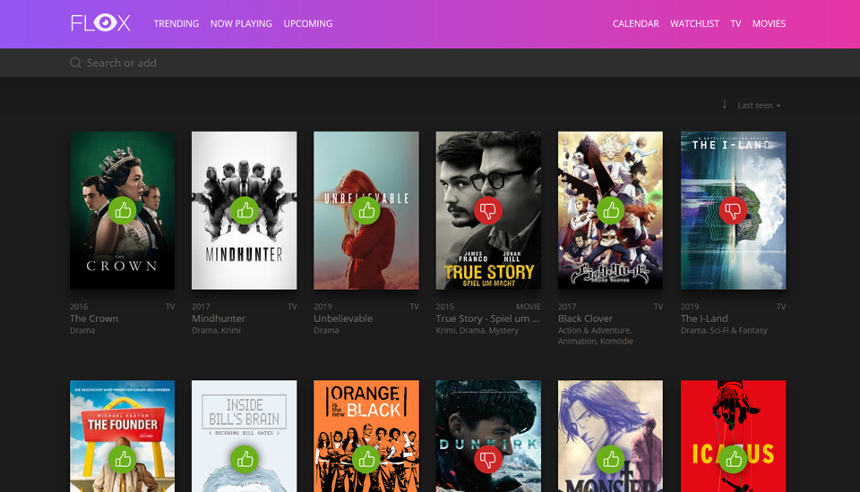

# About Flox

Flox is a self hosted Movie, Series and Animes watch list. It's build on top of Laravel and Vue.js and uses [The Movie Database](https://www.themoviedb.org/) API.
The rating based on an 3-Point system for `good`, `medium` and `bad`.

## Demo

[Try live demo](https://flox-demo.pyxl.dev) and [login](https://flox-demo.pyxl.dev/login) with `demo / demo` to add new stuff or change ratings.

::: info
This instance is not up-to-date with the latest features.
:::

## Contribution

Like this project? Want to contribute? Awesome! Feel free to [open some pull requests](https://github.com/Simounet/flox/pulls) or just open an issue.

## Changelog

Detailed changes for each release are documented in the [release notes](https://github.com/simounet/flox/releases).

## License

Flox is published under the MIT license.
